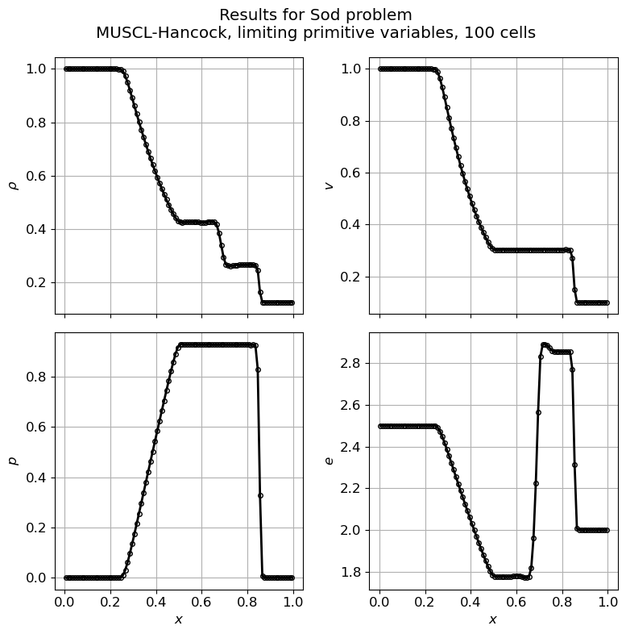

# Physics simulation tools

Copyright 2025 Robert B. Lowrie  
This software is covered by the MIT License.  
Please see the provided LICENSE file for more details.  

This is a collection of physics simulation tools that I created for sharing with students and collaborators.

The modules are:

* `base`: Base classes and utilities.
* `euler`: 1-D, finite-volume solver for the compressible Euler equations.
* `tools`: Tools for analyzing results.

I don't claim the methods used in `euler` are the state-of-the-art or even correct. I'd be happy to hear about improvements; feel free to provide a pull request.

## Requirements

The code is written in Python and requires version 3.1+.  I have tested the code on versions 3.10.16 and 3.13.2. 

All modules require that `numpy` be installed.  The `tools` module also requires `matplotlib`.

## Setup

On UNIX platorms, set the `PYTHONPATH` environment variable to the directory containing this `README`.  For example, using csh-based shells:

```sh
> setenv PYTHONPATH this_directory_path
```

## Running the Euler solver

There are two scripts main scripts

* `euler/driver.py`: Runs the Euler solver for a single case.
* `euler/benchmarks.py`: Runs the Euler solver for a series of test cases.

Each of these scripts provide help by using the `-h` option; for example, type

```sh
> euler/driver.py -h
```

As an example, to run Sod's shock-tube problem with 100 mesh cells:

```sh
> euler/driver.py sod 100
```

Two files will be created:

* `sod_100.out`: Output of the cycle number and time step, for each cycle.  Any errors will also be logged in the `*.out` file.
* `sod_100.plt`: Data with the simulation output at the final time, which may be plotted with the tools described below.

You can run all the benchmarks (including Sod's problem) with

```sh
> euler/benchmarks.py --outputdir benchmark_test
```
which will output all of the results to the directory `benchmark_test`.  Currently, 9 of 85 cases fail, typically either because of reconstructing conservative variables or because of the use of a limiter that is too aggressive (double minmod instead of minmod).

## Tools for analyzing results

Several tools that I wrote for analyzing the results are in the `tools` module:

* `tools/plotgnu.py`: Plots results on a single x-y plot. The `*.plt` output from the `euler` solver may be plotted with this script.
* `tools/plotgrid.py`: Plots results on a grid of x-y plots. The `*.plt` output from the `euler` solver may be plotted with this script.
* `tools/numdiff.py`: Compares two or more files that contain numerical data.

To plot the results of the previous example, run

```sh
> tools/plotgrid.py sod_100.plt --numrows 2 --xlabel '$x$' --ylabel '$\rho$' '$v$' '$p$' '$e$' --no-legend --title 'Results for Sod problem\nMUSCL-Hancock, limiting primitive variables, 100 cells'
```
The results are plotted at the bottom of this page. There are many other options for the `plotgrid.py`. All of the scripts provide a `-h` option for help.

Run this command to compare your benchmark results, generated above, with my results:
```sh
> tools/numdiff.py benchmark_test euler/benchmark_reference --include '*.plt'
```
This command does a "numerical difference" between the output directories, comparing the plot files.

